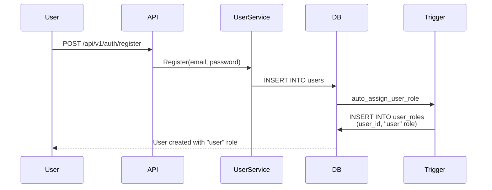
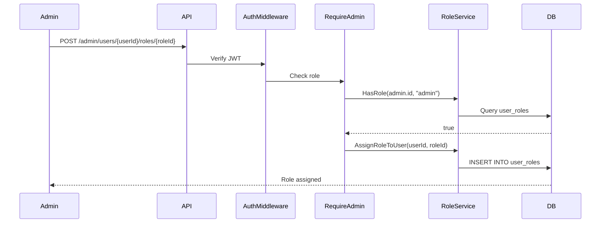
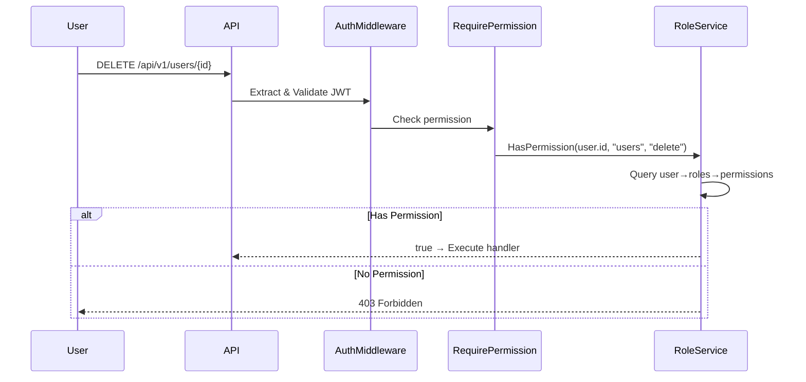

# Guía del Sistema RBAC (Role-Based Access Control)

## 📋 Tabla de Contenidos

1. [Introducción](#introducción)
2. [Conceptos Clave](#conceptos-clave)
3. [Roles y Permisos por Defecto](#roles-y-permisos-por-defecto)
4. [Flujos de Uso](#flujos-de-uso)
5. [API Endpoints](#api-endpoints)
6. [Ejemplos Prácticos](#ejemplos-prácticos)
7. [Casos de Uso Comunes](#casos-de-uso-comunes)

---

## Introducción

El sistema RBAC implementado permite controlar el acceso a recursos y operaciones basándose en **roles** asignados a los usuarios. Cada rol tiene asociado un conjunto de **permisos** que definen qué puede hacer el usuario.

### Características Principales

✅ **Auto-asignación de rol "user"** en registro
✅ **3 roles por defecto**: user, moderator, admin
✅ **Permisos granulares** por recurso y acción
✅ **Multi-App Support**: Roles específicos por aplicación
✅ **Middleware de autorización** para proteger endpoints
✅ **Gestión completa de roles** (CRUD + asignación)

---

## Conceptos Clave

### 1. Roles

Un **rol** es un conjunto de permisos asociado a una aplicación. Define "quién es" el usuario dentro del sistema.

```
Rol = Nombre + Descripción + App + Conjunto de Permisos
```

**Ejemplo:**
```json
{
  "id": "uuid",
  "app_id": "00000000-0000-0000-0000-000000000000",
  "name": "admin",
  "description": "Administrador con acceso completo"
}
```

### 2. Permisos

Un **permiso** es una acción específica sobre un recurso. Define "qué puede hacer" el usuario.

```
Permiso = Recurso + Acción
```

**Ejemplo:**
```json
{
  "id": "uuid",
  "name": "Delete User",
  "resource": "users",
  "action": "delete"
}
```

### 3. Apps

Una **app** es una aplicación registrada que usa el servicio de autenticación. Cada app puede tener roles diferentes para el mismo usuario.

```
App Base ID: 00000000-0000-0000-0000-000000000000
```

---

## Roles y Permisos por Defecto

### Roles

| Rol | Descripción | Asignación |
|-----|-------------|------------|
| **user** | Usuario estándar | Auto-asignado en registro |
| **moderator** | Moderador con permisos limitados | Manual (admin) |
| **admin** | Administrador con acceso completo | Manual (admin) |

### Matriz de Permisos

| Permiso | Resource | Action | user | moderator | admin |
|---------|----------|--------|------|-----------|-------|
| Leer propio perfil | users | read:own | ✅ | ✅ | ✅ |
| Actualizar propio perfil | users | update:own | ✅ | ✅ | ✅ |
| Listar todos los usuarios | users | read:all | ❌ | ✅ | ✅ |
| Crear usuario | users | create | ❌ | ❌ | ✅ |
| Actualizar cualquier usuario | users | update:any | ❌ | ❌ | ✅ |
| Eliminar usuario | users | delete | ❌ | ❌ | ✅ |
| Listar roles | roles | read | ❌ | ❌ | ✅ |
| Crear rol | roles | create | ❌ | ❌ | ✅ |
| Actualizar rol | roles | update | ❌ | ❌ | ✅ |
| Eliminar rol | roles | delete | ❌ | ❌ | ✅ |
| Asignar roles | roles | assign | ❌ | ❌ | ✅ |
| Ver todas las sesiones | sessions | read:all | ❌ | ✅ | ✅ |
| Revocar cualquier sesión | sessions | revoke:any | ❌ | ❌ | ✅ |
| Ver audit logs | audit | read | ❌ | ✅ | ✅ |

---

## Flujos de Uso

### Flujo 1: Registro de Usuario



**Resultado:** Todo usuario nuevo tiene automáticamente el rol `user`.

### Flujo 2: Asignar Rol Admin (por Admin)



### Flujo 3: Verificar Permiso en Request



---

## API Endpoints

### Endpoints Públicos

| Método | Endpoint | Descripción |
|--------|----------|-------------|
| `POST` | `/api/v1/auth/register` | Registrar usuario (auto-asigna rol "user") |
| `POST` | `/api/v1/auth/login` | Login |

### Endpoints Protegidos (Usuario Autenticado)

| Método | Endpoint | Descripción |
|--------|----------|-------------|
| `GET` | `/api/v1/users/me` | Obtener perfil propio |
| `GET` | `/api/v1/users/me/roles` | Ver mis roles |
| `GET` | `/api/v1/users/me/permissions` | Ver mis permisos |

### Endpoints Admin (Requiere rol "admin")

#### Gestión de Roles

| Método | Endpoint | Descripción |
|--------|----------|-------------|
| `POST` | `/api/v1/admin/roles` | Crear nuevo rol |
| `GET` | `/api/v1/admin/roles` | Listar roles de una app |
| `GET` | `/api/v1/admin/roles/:id` | Obtener rol específico |
| `PUT` | `/api/v1/admin/roles/:id` | Actualizar rol |
| `DELETE` | `/api/v1/admin/roles/:id` | Eliminar rol |
| `GET` | `/api/v1/admin/roles/:id/permissions` | Ver permisos de un rol |

#### Gestión de Asignaciones

| Método | Endpoint | Descripción |
|--------|----------|-------------|
| `POST` | `/api/v1/admin/users/:userId/roles/:roleId` | Asignar rol a usuario |
| `DELETE` | `/api/v1/admin/users/:userId/roles/:roleId` | Quitar rol de usuario |
| `GET` | `/api/v1/admin/users/:userId/roles` | Ver roles de un usuario |

### Endpoints Moderator (Requiere rol "moderator" o "admin")

| Método | Endpoint | Descripción |
|--------|----------|-------------|
| `GET` | `/api/v1/moderator/users/:userId/roles` | Ver roles de usuario |

---

## Ejemplos Prácticos

### 1. Registrar un Usuario

```bash
curl -X POST http://localhost:8080/api/v1/auth/register \
  -H "Content-Type: application/json" \
  -d '{
    "email": "user@example.com",
    "password": "SecurePass123!",
    "first_name": "John",
    "last_name": "Doe"
  }'
```

**Resultado:**
- Usuario creado con ID
- Rol `user` auto-asignado
- Email no verificado (email_verified=false)

### 2. Login y Obtener Token

```bash
curl -X POST http://localhost:8080/api/v1/auth/login \
  -H "Content-Type: application/json" \
  -d '{
    "email": "user@example.com",
    "password": "SecurePass123!",
    "app_id": "00000000-0000-0000-0000-000000000000"
  }'
```

**Respuesta:**
```json
{
  "tokens": {
    "access_token": "eyJhbGc...",
    "refresh_token": "eyJhbGc...",
    "expires_at": "2024-01-01T00:15:00Z",
    "token_type": "Bearer"
  },
  "user": {
    "id": "user-uuid",
    "email": "user@example.com",
    "first_name": "John",
    "last_name": "Doe"
  }
}
```

### 3. Ver Mis Roles

```bash
curl -X GET http://localhost:8080/api/v1/users/me/roles \
  -H "Authorization: Bearer YOUR_ACCESS_TOKEN"
```

**Respuesta:**
```json
{
  "roles": [
    {
      "id": "20000000-0000-0000-0000-000000000001",
      "app_id": "00000000-0000-0000-0000-000000000000",
      "name": "user",
      "description": "Usuario estándar con permisos básicos"
    }
  ],
  "count": 1
}
```

### 4. Ver Mis Permisos

```bash
curl -X GET http://localhost:8080/api/v1/users/me/permissions \
  -H "Authorization: Bearer YOUR_ACCESS_TOKEN"
```

**Respuesta:**
```json
{
  "permissions": [
    {
      "id": "10000000-0000-0000-0000-000000000001",
      "name": "Read Own Profile",
      "resource": "users",
      "action": "read:own"
    },
    {
      "id": "10000000-0000-0000-0000-000000000002",
      "name": "Update Own Profile",
      "resource": "users",
      "action": "update:own"
    }
  ],
  "count": 2
}
```

### 5. Promover Usuario a Admin (Requiere ser Admin)

**Paso 1:** Obtener ID del rol "admin"

```bash
curl -X GET "http://localhost:8080/api/v1/admin/roles?app_id=00000000-0000-0000-0000-000000000000" \
  -H "Authorization: Bearer ADMIN_ACCESS_TOKEN"
```

**Respuesta:**
```json
{
  "roles": [
    {
      "id": "20000000-0000-0000-0000-000000000002",
      "name": "admin",
      "description": "Administrador con acceso completo"
    },
    ...
  ]
}
```

**Paso 2:** Asignar rol admin al usuario

```bash
curl -X POST "http://localhost:8080/api/v1/admin/users/USER_UUID/roles/20000000-0000-0000-0000-000000000002" \
  -H "Authorization: Bearer ADMIN_ACCESS_TOKEN"
```

**Respuesta:**
```json
{
  "message": "Role assigned successfully"
}
```

### 6. Crear un Nuevo Rol Personalizado (Solo Admin)

```bash
curl -X POST http://localhost:8080/api/v1/admin/roles \
  -H "Authorization: Bearer ADMIN_ACCESS_TOKEN" \
  -H "Content-Type: application/json" \
  -d '{
    "app_id": "00000000-0000-0000-0000-000000000000",
    "name": "content_creator",
    "description": "Puede crear y gestionar contenido"
  }'
```

**Respuesta:**
```json
{
  "id": "new-role-uuid",
  "app_id": "00000000-0000-0000-0000-000000000000",
  "name": "content_creator",
  "description": "Puede crear y gestionar contenido",
  "created_at": "2024-01-01T00:00:00Z",
  "updated_at": "2024-01-01T00:00:00Z"
}
```

### 7. Intentar Acceso Sin Permisos

```bash
# Usuario normal intenta crear un rol (solo admin puede)
curl -X POST http://localhost:8080/api/v1/admin/roles \
  -H "Authorization: Bearer USER_ACCESS_TOKEN" \
  -H "Content-Type: application/json" \
  -d '{
    "app_id": "00000000-0000-0000-0000-000000000000",
    "name": "test_role",
    "description": "Test"
  }'
```

**Respuesta:**
```json
{
  "error": "Forbidden: insufficient permissions",
  "required_roles": ["admin"]
}
```

---

## Casos de Uso Comunes

### Caso 1: Sistema de Blog

**Roles:**
- `user`: Lector
- `author`: Puede escribir posts
- `editor`: Puede editar posts de otros
- `admin`: Gestión completa

**Permisos:**
```sql
-- Authors
INSERT INTO permissions (name, resource, action) VALUES
  ('Create Post', 'posts', 'create'),
  ('Update Own Post', 'posts', 'update:own'),
  ('Delete Own Post', 'posts', 'delete:own');

-- Editors
INSERT INTO permissions (name, resource, action) VALUES
  ('Update Any Post', 'posts', 'update:any'),
  ('Delete Any Post', 'posts', 'delete:any'),
  ('Publish Post', 'posts', 'publish');
```

**Flujo:**
1. Usuario se registra → rol `user`
2. Admin lo promueve a `author`
3. Autor puede crear/editar sus posts
4. Editor puede editar posts de cualquiera

### Caso 2: E-commerce

**Roles:**
- `customer`: Comprador
- `vendor`: Vendedor
- `support`: Soporte al cliente
- `admin`: Gestión completa

**Permisos:**
```sql
-- Customers
INSERT INTO permissions (name, resource, action) VALUES
  ('Place Order', 'orders', 'create'),
  ('View Own Orders', 'orders', 'read:own'),
  ('Cancel Own Order', 'orders', 'cancel:own');

-- Vendors
INSERT INTO permissions (name, resource, action) VALUES
  ('Create Product', 'products', 'create'),
  ('Update Own Product', 'products', 'update:own'),
  ('View Sales', 'sales', 'read:own');

-- Support
INSERT INTO permissions (name, resource, action) VALUES
  ('View All Orders', 'orders', 'read:all'),
  ('Refund Order', 'orders', 'refund'),
  ('Contact Customer', 'customers', 'contact');
```

### Caso 3: SaaS Multi-Tenant

**Roles por Organización:**
- `org_owner`: Dueño de la organización
- `org_admin`: Admin de la org
- `org_member`: Miembro regular
- `org_guest`: Acceso limitado

**Implementación:**
```bash
# Crear app para cada organización
curl -X POST /api/v1/admin/apps \
  -d '{
    "name": "Acme Corp",
    "client_id": "acme-corp-123"
  }'

# Crear roles específicos para esa app
curl -X POST /api/v1/admin/roles \
  -d '{
    "app_id": "acme-app-uuid",
    "name": "org_owner",
    "description": "Owner de Acme Corp"
  }'

# Asignar usuario a rol en esa organización
curl -X POST /api/v1/admin/users/{userId}/roles/{org_owner_role_id}
```

**Ventaja:** El mismo usuario puede tener roles diferentes en cada organización.

---

## Gestión Avanzada

### Crear Rol Admin Inicial

Si necesitas crear el primer administrador manualmente (directamente en DB):

```sql
-- 1. Crear el usuario admin (o usar uno existente)
-- Supongamos user_id = 'first-user-uuid'

-- 2. Obtener el ID del rol admin
SELECT id FROM roles WHERE name = 'admin' AND app_id = '00000000-0000-0000-0000-000000000000';
-- Resultado: 20000000-0000-0000-0000-000000000002

-- 3. Asignar rol admin al usuario
INSERT INTO user_roles (user_id, role_id, assigned_at)
VALUES (
  'first-user-uuid',
  '20000000-0000-0000-0000-000000000002',
  NOW()
);
```

### Verificar Roles y Permisos de un Usuario

```sql
-- Ver roles de un usuario
SELECT r.*
FROM roles r
INNER JOIN user_roles ur ON r.id = ur.role_id
WHERE ur.user_id = 'user-uuid';

-- Ver permisos de un usuario
SELECT DISTINCT p.*
FROM permissions p
INNER JOIN role_permissions rp ON p.id = rp.permission_id
INNER JOIN roles r ON rp.role_id = r.id
INNER JOIN user_roles ur ON r.id = ur.role_id
WHERE ur.user_id = 'user-uuid'
ORDER BY p.resource, p.action;

-- O usar la vista helper
SELECT *
FROM user_permissions
WHERE user_id = 'user-uuid';
```

### Proteger Endpoints Personalizados

En tu código Go, puedes usar los middlewares:

```go
// Opción 1: Requiere rol específico
app.Delete("/api/v1/posts/:id",
    authMiddleware,
    middleware.RequireRole(roleService, "admin", "moderator"),
    postHandler.Delete,
)

// Opción 2: Requiere permiso específico
app.Delete("/api/v1/posts/:id",
    authMiddleware,
    middleware.RequirePermission(roleService, "posts", "delete"),
    postHandler.Delete,
)

// Opción 3: Verificar programáticamente en el handler
func (h *PostHandler) Delete(c *fiber.Ctx) error {
    userID := c.Locals("user_id").(uuid.UUID)
    postID := c.Params("id")

    // Verificar si puede eliminar el post
    canDelete, _ := h.roleService.HasPermission(
        c.Context(),
        userID,
        "posts",
        "delete",
    )

    if !canDelete {
        return c.Status(403).JSON(fiber.Map{
            "error": "No tienes permiso para eliminar este post",
        })
    }

    // Continuar con la eliminación...
}
```

---

## Troubleshooting

### "No tengo acceso a endpoints /admin"

**Solución:** Verifica que tu usuario tenga el rol admin:
```bash
curl -X GET http://localhost:8080/api/v1/users/me/roles \
  -H "Authorization: Bearer YOUR_TOKEN"
```

### "El trigger no asigna rol automáticamente"

**Solución:** Ejecuta la migración 002:
```bash
docker-compose exec postgres psql -U auth -d authdb -f /migrations/002_seed_default_roles.sql
```

### "No puedo eliminar un rol"

**Causa:** El rol tiene usuarios asignados.

**Solución:**
1. Remover rol de todos los usuarios
2. Luego eliminar el rol

```bash
# Ver usuarios con ese rol
curl -X GET http://localhost:8080/api/v1/admin/roles/ROLE_ID

# Remover de cada usuario
curl -X DELETE http://localhost:8080/api/v1/admin/users/USER_ID/roles/ROLE_ID
```

---

## Próximos Pasos

1. ✅ Sistema RBAC implementado
2. ⏳ Agregar audit logging para cambios de roles
3. ⏳ UI de administración de roles
4. ⏳ Exportar permisos de usuario en JWT
5. ⏳ Soporte para permisos condicionales (ej: "solo si es owner")

---

**¿Necesitas ayuda?** Consulta los logs de audit o contacta al equipo de desarrollo.
