# Arquitectura y Flujos del Auth Service

## 📋 Tabla de Contenidos

1. [Casos de Uso](#casos-de-uso)
2. [Diagramas de Secuencia](#diagramas-de-secuencia)
3. [Funcionalidades Implementadas vs Pendientes](#funcionalidades-implementadas-vs-pendientes)
4. [Modelo de Datos](#modelo-de-datos)
5. [Seguridad](#seguridad)

---

## Casos de Uso

### ✅ Implementados

| Caso de Uso | Descripción | Endpoint |
|-------------|-------------|----------|
| **UC-01: Registro de Usuario** | Usuario nuevo se registra en el sistema | `POST /api/v1/auth/register` |
| **UC-02: Login** | Usuario autentica y obtiene tokens JWT | `POST /api/v1/auth/login` |
| **UC-03: Refresh Token** | Usuario renueva su access token sin re-autenticar | `POST /api/v1/auth/refresh` |
| **UC-04: Logout** | Usuario cierra sesión e invalida su refresh token | `POST /api/v1/auth/logout` |
| **UC-05: Obtener Perfil** | Usuario consulta su propia información | `GET /api/v1/users/me` |
| **UC-06: Health Check** | Sistema verifica estado de salud | `GET /health`, `GET /ready` |

### ⏳ Pendientes (según README.md original)

| Caso de Uso | Descripción | Endpoint Propuesto | Prioridad |
|-------------|-------------|-------------------|-----------|
| **UC-07: Verificación de Email** | Usuario verifica su email mediante token | `GET /api/v1/auth/verify-email/:token` | 🔴 Alta |
| **UC-08: Solicitar Reset Password** | Usuario solicita resetear su contraseña | `POST /api/v1/auth/forgot-password` | 🔴 Alta |
| **UC-09: Reset Password** | Usuario resetea su contraseña con token | `POST /api/v1/auth/reset-password` | 🔴 Alta |
| **UC-10: Setup MFA** | Usuario configura autenticación de dos factores | `POST /api/v1/auth/mfa/setup` | 🟡 Media |
| **UC-11: Verify MFA** | Usuario verifica código MFA durante login | `POST /api/v1/auth/mfa/verify` | 🟡 Media |
| **UC-12: Disable MFA** | Usuario desactiva MFA | `DELETE /api/v1/auth/mfa` | 🟡 Media |
| **UC-13: JWKS Endpoint** | Apps externas obtienen public keys | `GET /.well-known/jwks.json` | 🟢 Baja |
| **UC-14: OAuth2 Authorization** | Flujo OAuth2 authorization code | `GET /oauth2/authorize` | 🟢 Baja |
| **UC-15: OAuth2 Token Exchange** | Exchange code por tokens | `POST /oauth2/token` | 🟢 Baja |

---

## Diagramas de Secuencia

### UC-01: Registro de Usuario

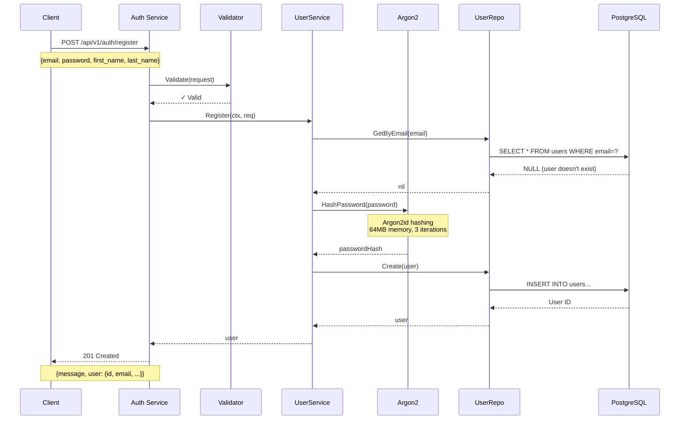

**Flujo:**
1. Cliente envía datos de registro
2. Se validan los campos (email válido, password ≥8 chars)
3. Se verifica que el email no exista
4. Se hashea la password con Argon2id
5. Se crea el usuario con status "active" pero email_verified=false
6. Se retorna el usuario creado

**⚠️ FALTANTE:**
- No se envía email de verificación
- El usuario puede hacer login sin verificar email

---

### UC-02: Login (Sin MFA)

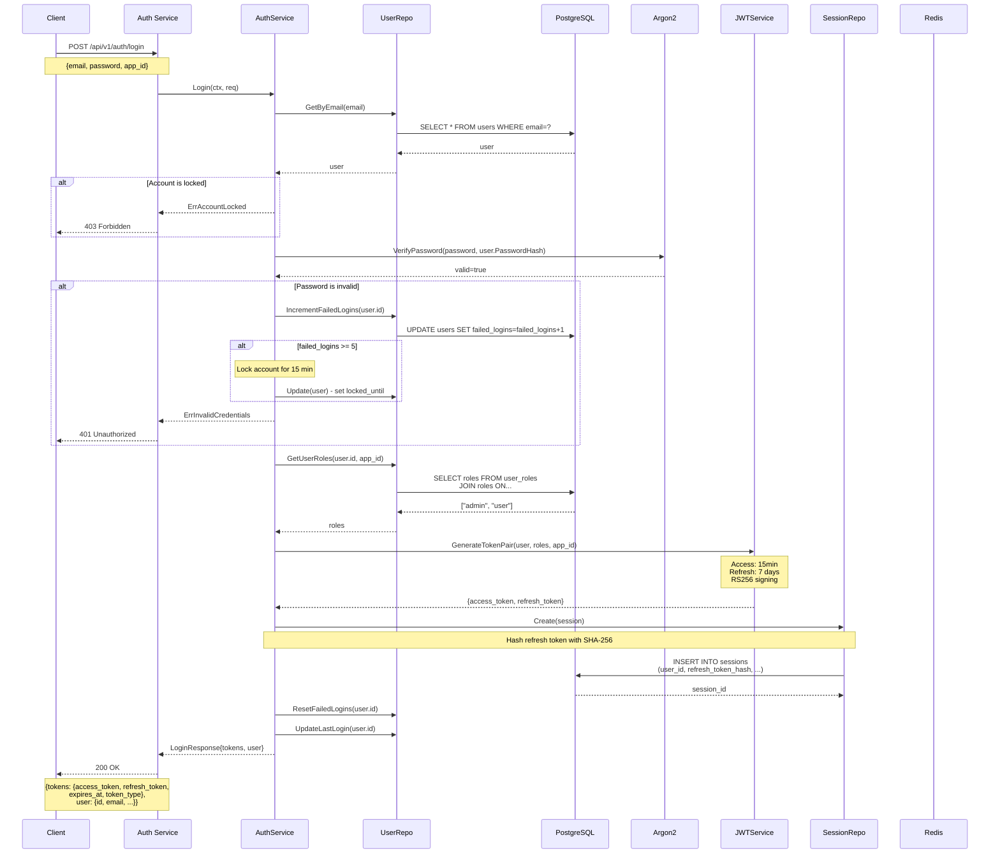

**Flujo:**
1. Cliente envía credenciales + app_id
2. Se busca el usuario por email
3. Se verifica si la cuenta está bloqueada
4. Se verifica la password con Argon2
5. Si falla, se incrementa contador de intentos fallidos
6. Si falla 5 veces, se bloquea la cuenta por 15 minutos
7. Se obtienen los roles del usuario para esa app específica
8. Se genera par de tokens JWT (access + refresh)
9. Se crea sesión en DB hasheando el refresh token
10. Se resetea contador de intentos fallidos
11. Se actualiza last_login timestamp

**⚠️ CONSIDERACIONES:**
- El bloqueo de cuenta es temporal (15 min)
- Cada app puede tener roles diferentes para el mismo usuario
- El refresh token se almacena hasheado en DB

---

### UC-02b: Login (Con MFA) - ⏳ PENDIENTE

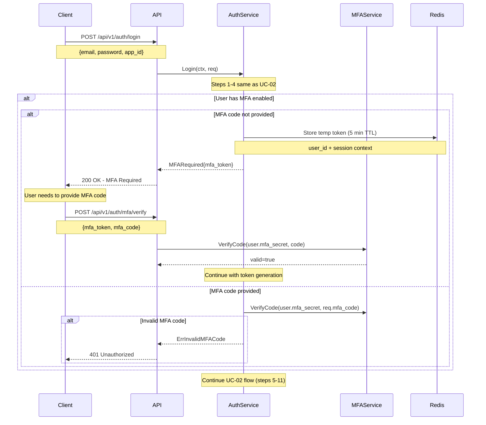

**⚠️ FALTANTE:** Este flujo NO está implementado actualmente

---

### UC-03: Refresh Token

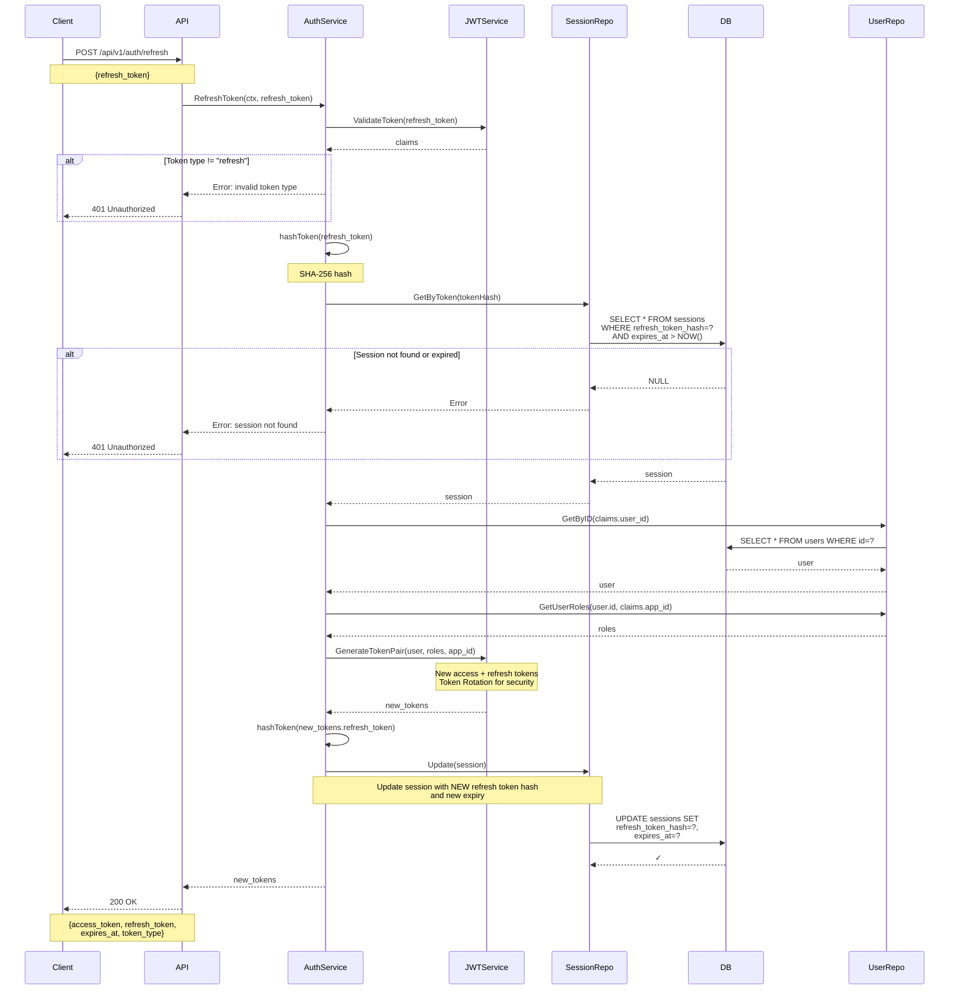

**Flujo:**
1. Cliente envía refresh token actual
2. Se valida el JWT y se verifica que sea tipo "refresh"
3. Se hashea el token con SHA-256
4. Se busca la sesión en DB por el hash
5. Se verifica que no esté expirada
6. Se obtiene el usuario y sus roles
7. Se genera un NUEVO par de tokens (rotation)
8. Se actualiza la sesión con el NUEVO refresh token hasheado
9. El viejo refresh token queda invalidado

**🔒 SEGURIDAD:**
- **Refresh Token Rotation**: Cada refresh invalida el token anterior
- Protege contra ataques de replay
- Si se detecta uso de token viejo, podría ser robo → invalidar todas las sesiones

---

### UC-04: Logout

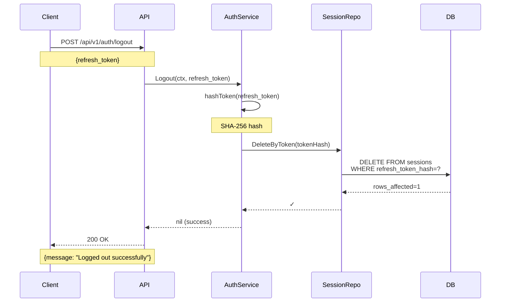

**Flujo:**
1. Cliente envía su refresh token
2. Se hashea el token
3. Se elimina la sesión de DB
4. El refresh token queda invalidado
5. El access token sigue siendo válido hasta su expiración

**⚠️ LIMITACIÓN ACTUAL:**
- El access token sigue funcionando hasta que expire (max 15 min)
- Para invalidación inmediata, se necesitaría:
  - Redis blacklist de access tokens
  - O validar cada request contra DB (más lento)

---

### UC-05: Obtener Perfil (Ruta Protegida)

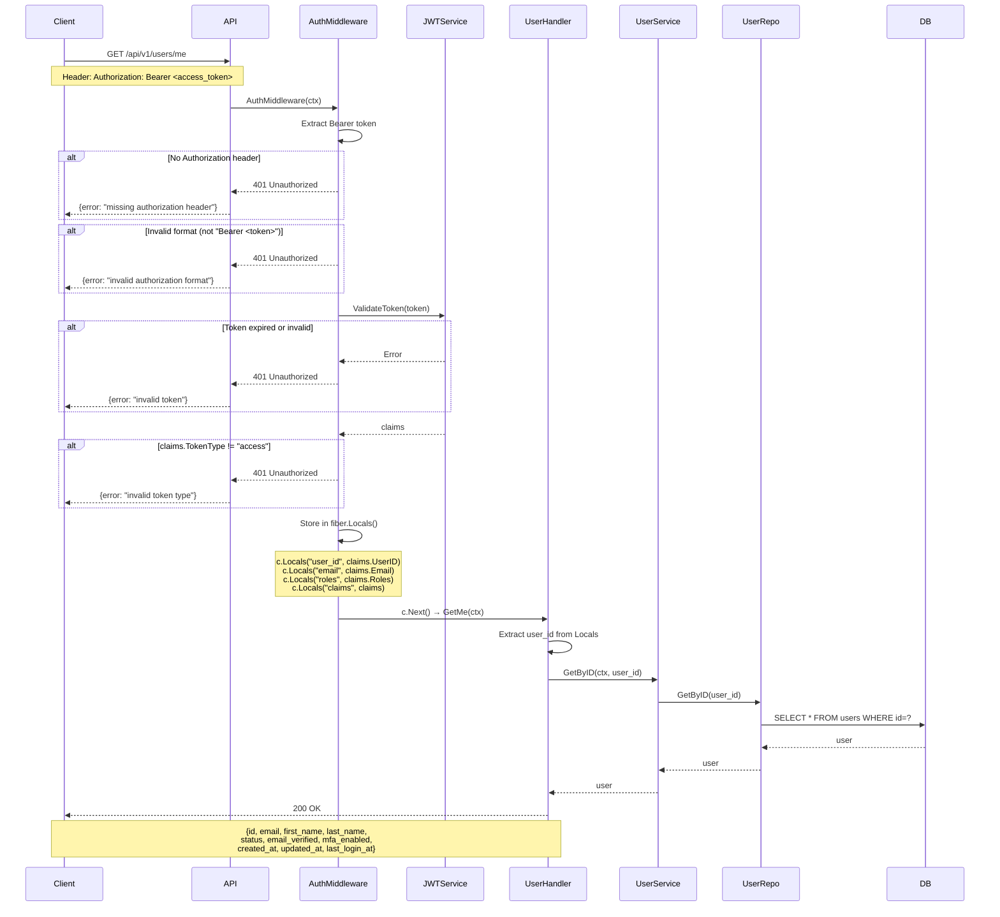

**Flujo:**
1. Cliente envía request con access token en header
2. AuthMiddleware intercepta el request
3. Extrae y valida el token JWT
4. Verifica que sea tipo "access" (no "refresh")
5. Almacena claims en fiber.Locals para handlers
6. Handler extrae user_id de Locals
7. Obtiene datos del usuario de DB
8. Retorna información del perfil

**🔒 SEGURIDAD:**
- Middleware valida CADA request a rutas protegidas
- No se consulta DB para validar token (solo firma criptográfica)
- Rápido pero access token sigue válido hasta expirar

---

### UC-07: Verificación de Email - ⏳ PENDIENTE

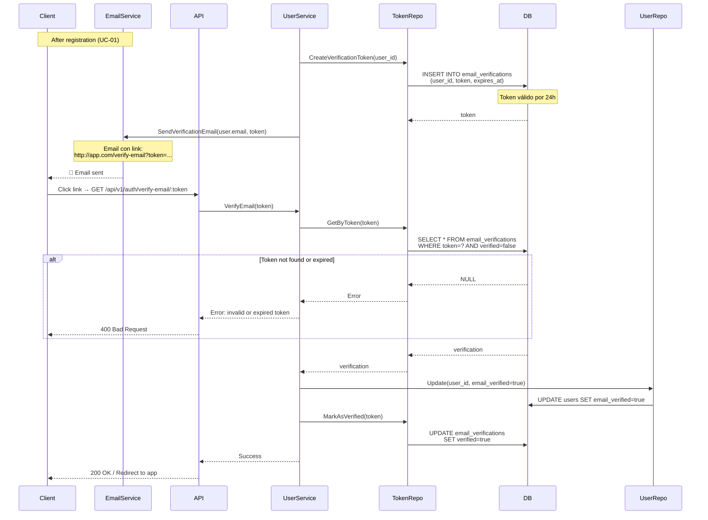

**✅ IMPLEMENTADO** - La funcionalidad usa campos `email_verification_token` y `email_verification_token_expires_at` en la tabla `users` directamente. La tabla `email_verifications` fue removida en v1.5.0 (no se usaba).

---

### UC-08 & UC-09: Reset Password - ⏳ PENDIENTE

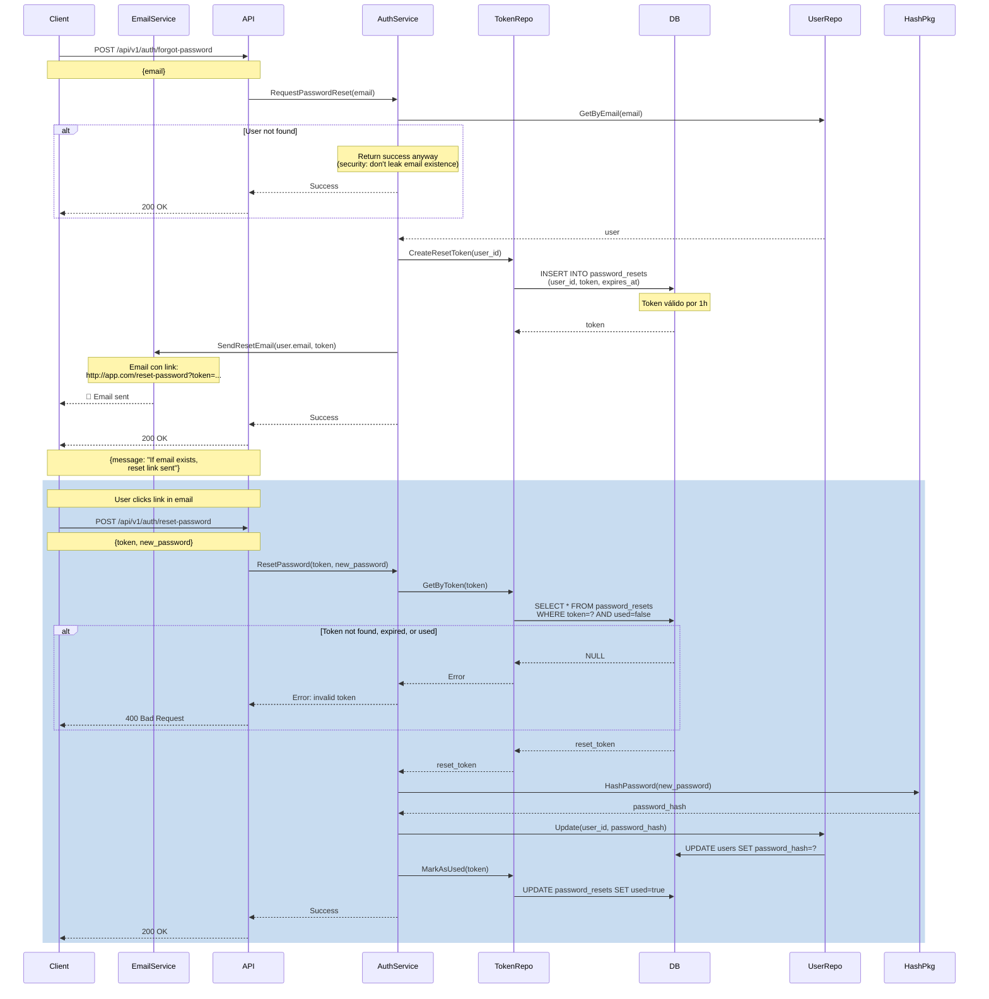

**✅ IMPLEMENTADO** - La funcionalidad usa campos `password_reset_token` y `password_reset_token_expires_at` en la tabla `users` directamente. La tabla `password_resets` fue removida en v1.5.0 (no se usaba).

---

## Funcionalidades Implementadas vs Pendientes

### ✅ Completamente Implementadas

| Feature | Status | Notas |
|---------|--------|-------|
| User Registration | ✅ | Con validación de email único |
| Login con Password | ✅ | Argon2id verification |
| JWT Token Generation | ✅ | RS256 con access + refresh |
| Refresh Token Rotation | ✅ | Seguro con SHA-256 hashing |
| Logout | ✅ | Invalida refresh token |
| Account Locking | ✅ | 5 intentos fallidos → 15 min lock |
| Session Management | ✅ | PostgreSQL + Redis ready |
| Protected Routes | ✅ | Middleware con JWT validation |
| User Profile | ✅ | GET /users/me |
| Health Checks | ✅ | /health y /ready |
| Multi-App Support | ✅ | Roles por app_id |
| RBAC Foundation | ✅ | Tablas de roles/permisos |

### ⏳ Parcialmente Implementadas

| Feature | Status | Qué Falta |
|---------|--------|-----------|
| Email Verification | 🟡 | Tabla existe, falta servicio/handler/email sender |
| Password Reset | 🟡 | Tabla existe, falta servicio/handler/email sender |
| MFA/2FA | 🟡 | Campos en user table, falta servicio completo |
| Role Management | 🟡 | Modelo existe, falta CRUD endpoints |

### ❌ No Implementadas

| Feature | Priority | Effort | Notas |
|---------|----------|--------|-------|
| Email Service Integration | 🔴 Alta | Medium | SendGrid, AWS SES, etc. |
| MFA Setup/Verify | 🟡 Media | Medium | TOTP con google/pquerna/otp |
| JWKS Endpoint | 🟢 Baja | Small | Para validación externa de JWTs |
| OAuth2 Provider | 🟢 Baja | Large | Autorización para third-party apps |
| Social Login | 🟢 Baja | Medium | Google, GitHub, etc. |
| Audit Logging | 🟡 Media | Small | Tabla existe, falta integración |
| Rate Limiting | 🟡 Media | Small | Por IP/usuario en endpoints críticos |
| Session Management UI | 🟢 Baja | Medium | Listar/revocar sesiones activas |

---

## Modelo de Datos

### Diagrama ER

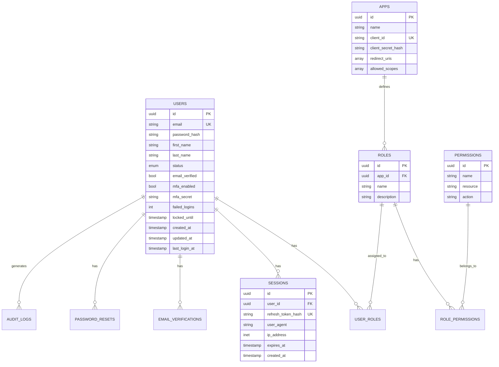

### Estados de Usuario

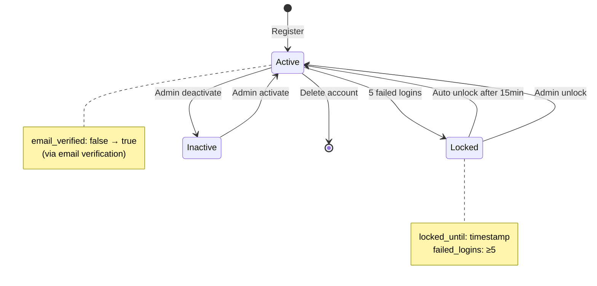

---

## Seguridad

### Layers de Seguridad

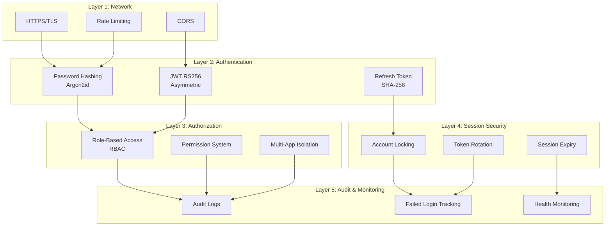

### Token Lifecycle

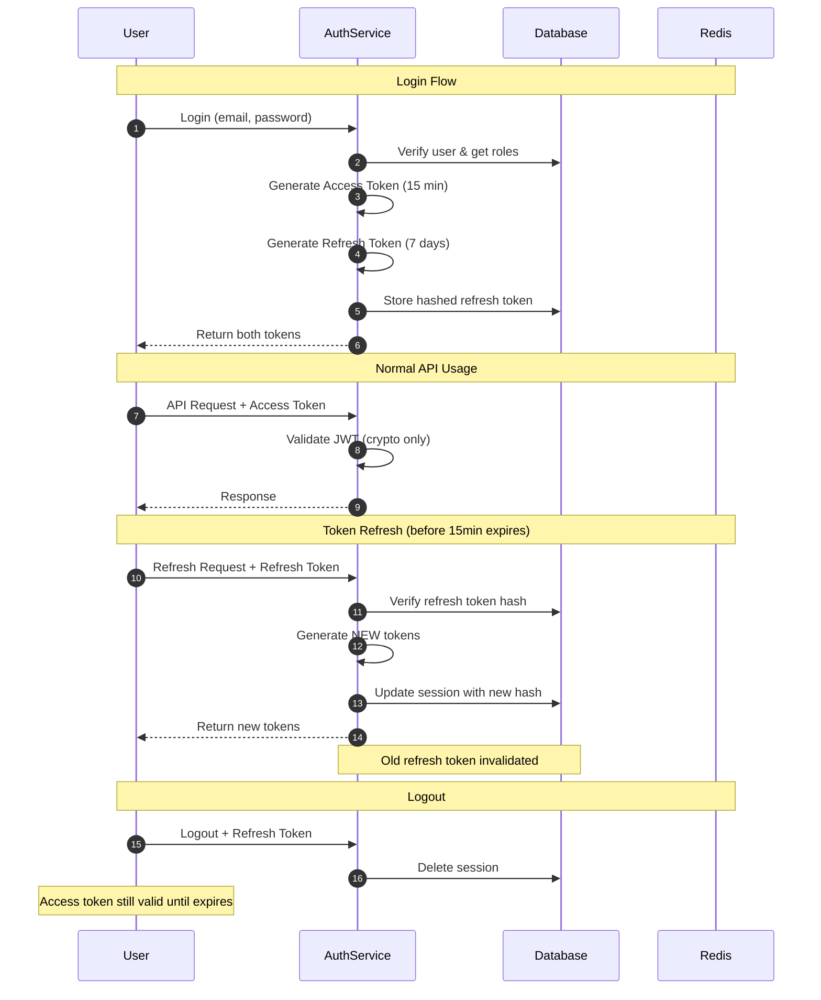

---

## Próximos Pasos Recomendados

### Fase 1: Completar Funcionalidades Core (1-2 semanas)

1. **Email Service Integration** 🔴
   - Integrar SendGrid o AWS SES
   - Implementar handlers para verify-email
   - Implementar forgot-password/reset-password
   - Templates de emails

2. **MFA/2FA Setup** 🟡
   - Implementar /mfa/setup (genera QR con TOTP secret)
   - Implementar /mfa/verify
   - Modificar login flow para soportar MFA
   - Implementar /mfa/disable

3. **Rate Limiting** 🟡
   - Middleware de rate limiting por IP
   - Límites especiales para /login (más restrictivo)
   - Redis para contador distribuido

### Fase 2: Seguridad y Observabilidad (1 semana)

4. **Audit Logging** 🟡
   - Loggear eventos críticos (login, logout, password change, etc.)
   - Integrar con audit_logs table
   - Endpoint para consultar logs propios

5. **Session Management** 🟢
   - GET /sessions - Listar sesiones activas
   - DELETE /sessions/:id - Revocar sesión específica
   - DELETE /sessions/all - Cerrar todas las sesiones

### Fase 3: Advanced Features (2-3 semanas)

6. **JWKS Endpoint** 🟢
   - GET /.well-known/jwks.json
   - Para que otras apps validen tokens sin shared secret

7. **OAuth2 Provider** 🟢
   - Authorization Code Flow
   - PKCE support
   - Consent screen

8. **Social Login** 🟢
   - OAuth2 clients para Google, GitHub
   - Link/unlink social accounts

---

## Conclusión

### ✅ Lo que tenemos es SÓLIDO:
- Arquitectura limpia y escalable
- Seguridad robusta (Argon2, RS256, token rotation)
- Multi-tenancy ready
- RBAC foundation

### ⚠️ Lo que FALTA para producción:
1. **Email verification** (crítico para seguridad)
2. **Password reset** (crítico para UX)
3. **MFA** (recomendado para apps sensibles)
4. **Rate limiting** (protección contra ataques)
5. **Audit logging** (compliance/debugging)

### 🎯 Prioridad de Implementación:
1. 🔴 **Email service + verification + reset** (1 semana)
2. 🟡 **Rate limiting** (2 días)
3. 🟡 **MFA/2FA** (3-4 días)
4. 🟡 **Session management endpoints** (2 días)
5. 🟢 **JWKS + OAuth2** (optional, 1-2 semanas)

**El sistema actual es funcional y seguro para desarrollo/staging, pero necesita las funcionalidades marcadas con 🔴 y 🟡 para producción.**
