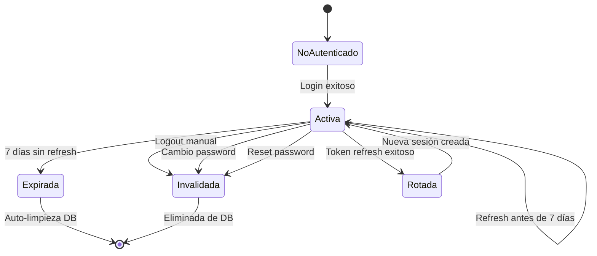

# Flujo de Login y Autenticación

Sistema de autenticación multi-tenant con JWT, session management, token rotation y protección contra ataques de fuerza bruta.

---

## 🎯 Objetivos del Sistema

| Objetivo | Descripción |
|----------|-------------|
| **Autenticación Segura** | Verificar identidad del usuario con password hashing Argon2id |
| **Multi-Tenant Isolation** | Login específico por aplicación con app_id |
| **Session Management** | Gestión centralizada de sesiones activas con metadata |
| **Token Security** | JWT con RS256, token rotation y blacklist |
| **Brute-Force Protection** | Account locking después de intentos fallidos |
| **Seamless UX** | Refresh automático sin re-login durante 7 días |

---

## 📊 Diagrama de Flujo Completo

```
┌──────────────┐
│   Usuario    │
│ abre /login  │
└──────┬───────┘
       │
       ↓
┌─────────────────────────────┐
│ GET /auth/login             │
│ Origin: https://app-a.com   │ ←─ Browser envía automáticamente
└──────┬──────────────────────┘
       │
       ↓
┌─────────────────────────────────────┐
│ Auth Service                        │
│ 1. Detecta Origin header            │
│ 2. Busca app en DB por web_origins  │
│ 3. Genera CSRF token                │
│ 4. Renderiza template con branding  │
└──────┬──────────────────────────────┘
       │
       ↓
┌─────────────────────────────┐
│ Usuario ingresa credenciales│
│ - Email                     │
│ - Password                  │
└──────┬──────────────────────┘
       │
       ↓
┌─────────────────────────────────────┐
│ POST /api/v1/auth/login             │
│ Headers:                            │
│   Origin: https://app-a.com         │
│   X-CSRF-Token: abc123...           │
│ Cookies:                            │
│   csrf_token: abc123...             │
│ Body: {email, password}             │
└──────┬──────────────────────────────┘
       │
       ↓
┌─────────────────────────────────────┐
│ Validaciones de Seguridad           │
│ ✓ CSRF token match                  │
│ ✓ Origin permitido                  │
│ ✓ App existe y está activa          │
│ ✓ Usuario existe en esta app        │
│ ✓ Email verificado                  │
│ ✓ Cuenta no bloqueada                │
└──────┬──────────────────────────────┘
       │
       ↓
┌─────────────────────────────────────┐
│ Validación de Password              │
│ 1. Obtener hash Argon2id de DB      │
│ 2. Comparar con password ingresado  │
│ 3. Constant-time comparison         │
└──────┬──────────────────────────────┘
       │
       ├─→ Password INCORRECTO
       │   ├─ Incrementar failed_attempts
       │   ├─ Si >= 5: Bloquear cuenta 15min
       │   └─ Retornar 401 Unauthorized
       │
       ↓ Password CORRECTO
┌─────────────────────────────────────┐
│ Generación de Tokens JWT            │
│ 1. Access Token (RS256, 15 min)     │
│    Claims: user_id, email, roles,   │
│            app_id, tenant_id        │
│ 2. Refresh Token (RS256, 7 días)    │
│    Claims: user_id, app_id, jti     │
└──────┬──────────────────────────────┘
       │
       ↓
┌─────────────────────────────────────┐
│ Creación de Sesión                  │
│ 1. Hash SHA-256 del refresh token   │
│ 2. Guardar en DB sessions:          │
│    - user_id, app_id, tenant_id     │
│    - refresh_token_hash             │
│    - ip_address, user_agent         │
│    - expires_at (7 días)            │
│ 3. Resetear failed_attempts = 0     │
└──────┬──────────────────────────────┘
       │
       ↓
┌─────────────────────────────┐
│ Respuesta al Cliente        │
│ 200 OK                      │
│ {                           │
│   access_token: "eyJ...",   │
│   refresh_token: "eyJ...",  │
│   user: {...},              │
│   expires_in: 900           │
│ }                           │
└──────┬──────────────────────┘
       │
       ↓
┌─────────────────────────────┐
│ Cliente usa access_token    │
│ Authorization: Bearer ...   │
└─────────────────────────────┘
```

---

## 🔐 Auto-Detección de Aplicación

### Fuentes de Detección (Mismo que Registro)

| # | Header/Source | Confiable | Comportamiento |
|---|---------------|-----------|----------------|
| 1 | `Origin` | ✅ Browser-controlled | Buscar app donde `app.web_origins` CONTAINS origin |
| 2 | `Referer` | ⚠️ Puede faltar | Fallback si Origin no existe |
| 3 | `Host` | ✅ Siempre presente | Último fallback para same-origin |

### Validación Multi-Tenant

```
Request con Origin: https://app-a.com
    ↓
Buscar: SELECT * FROM apps WHERE web_origins @> '["https://app-a.com"]'
    ↓
¿App encontrada?
    ├─→ SÍ: app_id = uuid-app-a
    │        Buscar usuario: WHERE app_id = uuid-app-a AND email = X
    │        ↓
    │        ¿Usuario existe en esta app?
    │        ├─→ SÍ: Procesar login
    │        └─→ NO: 401 "Credenciales inválidas"
    │
    └─→ NO: 403 "Origin no autorizado"
```

### Beneficios de Seguridad

| Beneficio | Descripción |
|-----------|-------------|
| **Cross-App Prevention** | Usuario de App A no puede hacer login en App B aunque tenga mismo email |
| **No Credential Leakage** | Credenciales de App A no funcionan en App B (diferentes passwords) |
| **Isolation Enforcement** | Queries siempre filtran por app_id detectado del Origin |

---

## 🎟️ Sistema de Tokens JWT

### Arquitectura de Doble Token

| Token | Duración | Claims | Uso | Almacenamiento |
|-------|----------|--------|-----|----------------|
| **Access Token** | 15 minutos | user_id, email, roles, permissions, app_id, tenant_id, exp, iat | Autenticación en cada request | Cliente (memoria o localStorage) |
| **Refresh Token** | 7 días | user_id, app_id, jti, exp, iat | Renovar access token sin re-login | Cliente + Hash SHA-256 en DB |

### Claims del Access Token

| Claim | Tipo | Descripción | Ejemplo |
|-------|------|-------------|---------|
| `iss` | string | Issuer del token | `"auth-service"` |
| `sub` | UUID | User ID | `"uuid-123..."` |
| `uid` | UUID | User ID (duplicado para compatibilidad) | `"uuid-123..."` |
| `email` | string | Email del usuario | `"user@example.com"` |
| `roles` | []string | Roles del usuario en esta app | `["user", "admin"]` |
| `permissions` | []string | Permisos efectivos agregados | `["users:read", "users:write"]` |
| `app_id` | UUID | ID de la aplicación | `"uuid-app-a"` |
| `tenant_id` | UUID | ID del tenant (si aplica) | `"uuid-tenant-1"` |
| `exp` | int64 | Timestamp de expiración | `1703980800` |
| `iat` | int64 | Timestamp de emisión | `1703980000` |
| `jti` | UUID | Token ID único | `"uuid-token-123"` |
| `type` | string | Tipo de token | `"access"` |

### Claims del Refresh Token

| Claim | Tipo | Descripción |
|-------|------|-------------|
| `iss` | string | Issuer del token |
| `sub` | UUID | User ID |
| `app_id` | UUID | ID de la aplicación |
| `exp` | int64 | Expira en 7 días |
| `iat` | int64 | Timestamp de emisión |
| `jti` | UUID | Token ID único |
| `type` | string | `"refresh"` |

### Ventajas del Enfoque RS256

| Ventaja | Descripción |
|---------|-------------|
| **Validación Distribuida** | Otros microservicios pueden validar tokens con clave pública |
| **JWKS Endpoint** | `/.well-known/jwks.json` expone clave pública |
| **No Shared Secret** | No necesita distribuir clave privada |
| **API Gateway Compatible** | Kong, Nginx, Traefik pueden validar sin llamar a auth-service |

---

## 💾 Session Management

### Modelo de Sesión en PostgreSQL

| Campo | Tipo | Descripción |
|-------|------|-------------|
| `id` | UUID | ID único de la sesión |
| `user_id` | UUID | FK a tabla users |
| `app_id` | UUID | FK a tabla apps |
| `tenant_id` | UUID | FK a tabla tenants (nullable) |
| `refresh_token_hash` | string | SHA-256 del refresh token |
| `ip_address` | string | IP del cliente (IPv4/IPv6) |
| `user_agent` | text | Browser/Device info |
| `expires_at` | timestamp | Expiración (7 días desde creación) |
| `created_at` | timestamp | Timestamp de login |
| `updated_at` | timestamp | Última renovación |

### Flujo de Creación de Sesión

```
Login exitoso
    ↓
Generar refresh_token JWT
    ↓
Calcular SHA-256(refresh_token) → hash
    ↓
INSERT INTO sessions (
    user_id, app_id, tenant_id,
    refresh_token_hash,
    ip_address, user_agent,
    expires_at = NOW() + 7 days
)
    ↓
Retornar access_token + refresh_token al cliente
```

### Metadata de Sesión

| Metadata | Fuente | Uso |
|----------|--------|-----|
| **IP Address** | Headers: `X-Forwarded-For`, `X-Real-IP`, o socket remote address | Detectar login desde nueva ubicación |
| **User Agent** | Header: `User-Agent` | Identificar dispositivo/browser |
| **Creation Time** | `created_at` | Saber cuándo inició sesión |
| **Last Activity** | `updated_at` | Actualizado en cada refresh |

---

## 🔄 Token Refresh Flow

### Proceso de Renovación

```
Access token expirado (después de 15 min)
    ↓
Cliente detecta 401 en API request
    ↓
POST /api/v1/auth/refresh
Body: { refresh_token: "eyJ..." }
    ↓
Validaciones:
    ├─ JWT signature válida (RS256)
    ├─ Token no expirado (< 7 días)
    ├─ Tipo = "refresh"
    ├─ Hash SHA-256 existe en tabla sessions
    ├─ No está en blacklist Redis
    └─ Sesión no expirada
    ↓
Todas válidas → Proceder
    ↓
┌─────────────────────────────────┐
│ Token Rotation                  │
│ 1. Generar NUEVO refresh token  │
│ 2. Invalidar token ANTERIOR     │
│    (eliminar de sessions)       │
│ 3. Crear nueva sesión con hash  │
│ 4. Generar NUEVO access token   │
└──────┬──────────────────────────┘
       │
       ↓
Respuesta: {
    access_token: "nuevo...",
    refresh_token: "nuevo...",
    expires_in: 900
}
```

### Token Rotation (Seguridad)

| Paso | Acción | Razón |
|------|--------|-------|
| 1 | Token viejo se usa una vez | Detectar tokens robados |
| 2 | Nuevo token generado | Evitar replay attacks |
| 3 | Token viejo invalidado | No puede reusarse |
| 4 | Si token viejo se usa 2+ veces | Sesión comprometida → invalidar todas las sesiones del usuario |

---

## 🛡️ Capas de Seguridad en Login

### 1. CSRF Protection

| Componente | Implementación |
|------------|----------------|
| **Patrón** | Double Submit Cookie |
| **Validación** | Cookie `csrf_token` == Header `X-CSRF-Token` |
| **Algoritmo** | Constant-time comparison |

### 2. Account Locking (Brute-Force Protection)

| Parámetro | Valor | Configurable |
|-----------|-------|--------------|
| **Max Intentos Fallidos** | 5 | Env: `AUTH_MAX_FAILED_LOGINS` |
| **Duración de Bloqueo** | 15 minutos | Env: `AUTH_LOCK_DURATION` |
| **Reset de Contador** | En login exitoso | Automático |

**Flujo de Bloqueo:**

```
Intento 1 fallido → failed_attempts = 1
Intento 2 fallido → failed_attempts = 2
Intento 3 fallido → failed_attempts = 3
Intento 4 fallido → failed_attempts = 4
Intento 5 fallido → failed_attempts = 5
                  → account_locked_until = NOW() + 15 min
                  → 423 Locked "Cuenta bloqueada por 15 minutos"

Después de 15 min:
    ↓
Intento login → Validar: account_locked_until < NOW()
              → Desbloqueado automáticamente
              → failed_attempts = 0
```

### 3. Email Verification Enforcement

| Estado | Puede Login | Acción |
|--------|-------------|--------|
| `is_verified = false` | ❌ | 403 "Verifica tu email antes de hacer login" |
| `is_verified = true` | ✅ | Procesar login normalmente |

### 4. Password Validation

| Aspecto | Detalle |
|---------|---------|
| **Hashing** | Argon2id (64MB, 3 iterations, parallelism 2) |
| **Comparación** | Constant-time para prevenir timing attacks |
| **Salt** | Único por usuario (16 bytes) |
| **Storage** | Solo hash, nunca plaintext |

### 5. Token Blacklist (Redis)

#### Sistema de Dos Niveles

**Nivel 1 - Tokens Individuales:**

| Key | Value | TTL | Uso |
|-----|-------|-----|-----|
| `blacklist:token:<sha256_hash>` | `"1"` | Hasta expiración del token | Logout específico |

**Nivel 2 - Invalidación por Usuario:**

| Key | Value | TTL | Uso |
|-----|-------|-----|-----|
| `blacklist:user:<user_id>` | timestamp UNIX de invalidación | 24 horas | Cambio/reset de password |

**Lógica de Validación:**

```
Token llega en Authorization header
    ↓
Extraer claims: user_id, iat (IssuedAt)
    ↓
Check 1: ¿SHA-256(token) existe en Redis?
    ├─→ SÍ: 401 "Token invalidado"
    └─→ NO: Continuar
    ↓
Check 2: Obtener blacklist:user:<user_id>
    ├─→ Existe: invalidation_timestamp
    │   ├─→ iat < invalidation_timestamp: 401 "Token invalidado"
    │   └─→ iat >= invalidation_timestamp: Token válido
    └─→ No existe: Token válido
```

---

## 📝 Estados y Transiciones de Sesión

### Modelo de Estados



### Tabla de Estados de Sesión

| Estado | Campos DB | Puede Usar Access Token | Puede Refresh | Notas |
|--------|-----------|-------------------------|---------------|-------|
| **No Autenticado** | No existe en DB | ❌ | ❌ | Usuario no ha hecho login |
| **Activa** | `expires_at > NOW()` | ✅ | ✅ | Sesión válida y usable |
| **Rotada** | Token viejo eliminado | ❌ | ❌ | Token rotation ejecutado |
| **Expirada** | `expires_at <= NOW()` | ❌ | ❌ | Debe re-autenticarse |
| **Invalidada** | No existe en DB (eliminada) | ❌ | ❌ | Logout o password change |

---

## 🔄 Casos de Uso Especiales

### Caso 1: Login con Cuenta No Verificada

```
POST /login con email no verificado
    ↓
Validación: SELECT * WHERE email=X AND app_id=Y
    ↓
Usuario existe pero is_verified = false
    ↓
Respuesta: 403 Forbidden
{
    "error": "Email no verificado",
    "action": "verify_email",
    "resend_url": "/api/v1/auth/resend-verification"
}
```

**UX en Frontend:**
- Mostrar mensaje: "Verifica tu email para continuar"
- Botón: "Reenviar email de verificación"

### Caso 2: Login desde Nueva IP (Detección de Anomalías)

```
Login exitoso desde nueva IP
    ↓
Comparar: SELECT DISTINCT ip_address FROM sessions WHERE user_id=X
    ↓
Nueva IP detectada
    ↓
Acciones:
    ├─ Crear sesión normalmente
    ├─ Enviar email de notificación (opcional)
    │  "Nuevo login desde IP: X.X.X.X"
    └─ Registrar evento en audit_logs
```

### Caso 3: Múltiples Sesiones Activas

```
Usuario hace login desde:
    - Desktop (Chrome, IP: 192.168.1.10)
    - Mobile (Safari, IP: 10.0.0.5)
    - Tablet (Firefox, IP: 192.168.1.15)
    ↓
Sesiones en DB:
    ├─ session_1: Desktop, refresh_token_1
    ├─ session_2: Mobile, refresh_token_2
    └─ session_3: Tablet, refresh_token_3
    ↓
Todas activas simultáneamente
    ↓
Usuario puede ver sesiones en /api/v1/users/me/sessions
    ↓
Cerrar sesión específica: DELETE /sessions/:id
Cerrar todas: DELETE /sessions?exclude_current=true
```

### Caso 4: Token Comprometido (Replay Attack Detection)

```
Refresh token usado en request 1
    ↓
Token rotation: nuevo_token generado, viejo_token invalidado
    ↓
Atacante intenta usar viejo_token en request 2
    ↓
Validación: Token no existe en sessions (ya fue rotado)
    ↓
Sospecha de compromiso → Acción:
    ├─ Invalidar TODAS las sesiones del usuario
    ├─ Enviar email de alerta
    ├─ Registrar en audit_logs
    └─ Respuesta: 401 "Token inválido"
```

### Caso 5: OAuth2 Flow (Preparado)

```
Login con OAuth2 (Google, GitHub, etc.)
    ↓
Parámetros recibidos:
    - redirect_uri
    - response_type = code
    - state
    - scope
    ↓
Autenticar usuario normalmente
    ↓
Mostrar consent screen (opcional)
    ↓
Generar authorization_code
    ↓
Redirect: {redirect_uri}?code=XXX&state=YYY
```

---

## 📊 Métricas y Monitoreo

### Eventos a Trackear

| Evento | Metadata | Uso |
|--------|----------|-----|
| `login.attempt` | app_id, email, ip, user_agent | Rate de intentos |
| `login.success` | app_id, user_id, ip, device_type | Conversión de login |
| `login.failure` | app_id, email, reason (wrong_password, not_verified, locked) | Debugging UX |
| `login.account_locked` | app_id, user_id, ip | Detectar ataques |
| `token.refresh` | app_id, user_id, session_id | Engagement (cuánto usan la app) |
| `token.rotation` | app_id, user_id | Security audit |
| `session.created` | app_id, user_id, ip, device | Nuevas sesiones |
| `session.expired` | app_id, user_id, session_id | Churn (no volvieron en 7 días) |

### Métricas de Negocio

| Métrica | Cálculo | Insight |
|---------|---------|---------|
| **Login Success Rate** | logins_exitosos / total_intentos | Fricciones en UX |
| **Account Lock Rate** | cuentas_bloqueadas / total_usuarios | Posibles ataques |
| **Session Duration** | AVG(expires_at - created_at) | Engagement |
| **Token Refresh Frequency** | refreshes / día / usuario | App usage intensity |
| **Multi-Device Users** | Usuarios con >1 sesión activa | Cross-device behavior |

### Alertas Críticas

| Condición | Threshold | Acción |
|-----------|-----------|--------|
| **Login Failures** | >100 fallos/min en una IP | Rate limiting o ban temporal |
| **Account Locks** | >50 cuentas bloqueadas/hora | Posible ataque distribuido |
| **Token Rotation Failures** | >10% de refreshes fallan | Investigar blacklist/DB issues |
| **Session DB Size** | >1M sesiones activas | Limpieza de sesiones expiradas |

---

## 🚀 Próximas Mejoras

| Feature | Prioridad | Descripción |
|---------|-----------|-------------|
| **Rate Limiting Activo** | Alta | Limitar intentos de login por IP (10/min) |
| **MFA/2FA** | Alta | TOTP con Google Authenticator, Authy |
| **Remember Me** | Media | Refresh token de 30 días para "Recordarme" |
| **Device Fingerprinting** | Media | Detectar dispositivos conocidos vs nuevos |
| **Geo-IP Blocking** | Baja | Bloquear login desde países sospechosos |
| **Session Anomaly Detection** | Baja | ML para detectar patrones anormales |

---

## 🔗 Endpoints Relacionados

| Endpoint | Método | Descripción |
|----------|--------|-------------|
| `/auth/login` | GET | Renderiza formulario de login |
| `/api/v1/auth/login` | POST | Procesa credenciales y retorna tokens |
| `/api/v1/auth/refresh` | POST | Renueva access token con refresh token |
| `/api/v1/auth/logout` | POST | Invalida sesión y tokens |
| `/api/v1/users/me/sessions` | GET | Lista sesiones activas del usuario |
| `/api/v1/users/me/sessions/:id` | DELETE | Cierra sesión específica |
| `/api/v1/users/me/sessions` | DELETE | Cierra todas las sesiones |

---

**Última Actualización:** 2024-12-21
