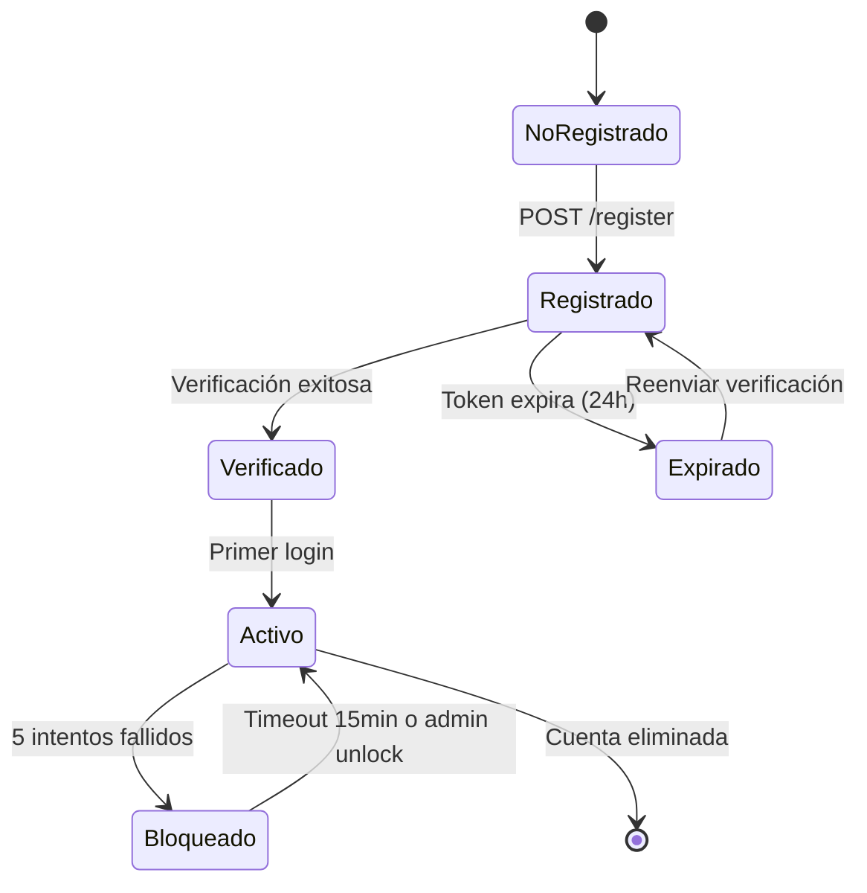

# Flujo de Registro de Usuarios

Sistema de registro multi-tenant con auto-detección de aplicaciones, templates dinámicos y verificación por email.

---

## 🎯 Objetivos del Sistema

| Objetivo                     | Descripción                                                                   |
| ---------------------------- | ----------------------------------------------------------------------------- |
| **Aislamiento Multi-Tenant** | Cada aplicación tiene usuarios completamente independientes                   |
| **Auto-Detección Segura**    | Identificar la app automáticamente desde headers HTTP (sin input del usuario) |
| **Templates Dinámicos**      | Servir formularios y emails personalizados por aplicación                     |
| **Verificación de Email**    | Asegurar que el usuario controla el email registrado                          |
| **Seguridad por Diseño**     | Prevenir ataques de cross-app, enumeración de usuarios, CSRF                  |

---

## 📊 Diagrama de Flujo Completo

```
┌──────────────┐
│   Usuario    │
│ abre browser │
└──────┬───────┘
       │
       ↓
┌─────────────────────────────┐
│ GET /auth/register          │
│ Origin: https://app-a.com   │ ←─ Browser envía automáticamente
└──────┬──────────────────────┘
       │
       ↓
┌─────────────────────────────────────┐
│ Auth Service                        │
│ 1. Detecta Origin header            │
│ 2. Busca app en DB por web_origins  │
│ 3. Genera CSRF token                │
│ 4. Renderiza template con branding  │
└──────┬──────────────────────────────┘
       │
       ↓
┌─────────────────────────────┐
│ Usuario completa formulario │
│ - Nombre, apellido          │
│ - Email                     │
│ - Password                  │
└──────┬──────────────────────┘
       │
       ↓
┌─────────────────────────────────────┐
│ POST /api/v1/auth/register          │
│ Headers:                            │
│   Origin: https://app-a.com         │
│   X-CSRF-Token: abc123...           │
│ Cookies:                            │
│   csrf_token: abc123...             │
│ Body: {email, password, ...}        │
└──────┬──────────────────────────────┘
       │
       ↓
┌─────────────────────────────────────┐
│ Validaciones de Seguridad           │
│ ✓ CSRF token match                  │
│ ✓ Origin permitido                  │
│ ✓ App existe y está activa          │
│ ✓ Email no existe en esta app       │
└──────┬──────────────────────────────┘
       │
       ↓
┌─────────────────────────────────────┐
│ Creación del Usuario                │
│ 1. Hash password (Argon2id)         │
│ 2. Crear user en DB con app_id      │
│ 3. Generar token verificación (24h) │
│ 4. Asignar rol "user" (trigger)     │
└──────┬──────────────────────────────┘
       │
       ↓
┌─────────────────────────────────────┐
│ Envío de Email Dinámico             │
│ 1. Construir URL con origin         │
│    https://app-a.com/auth/verify... │
│ 2. Renderizar template HTML         │
│ 3. Enviar vía CloudCentinel         │
└──────┬──────────────────────────────┘
       │
       ↓
┌─────────────────────────────┐
│ Respuesta al Cliente        │
│ 201 Created                 │
│ {user: {...}, message: ...} │
└──────┬──────────────────────┘
       │
       ↓
┌─────────────────────────────┐
│ Usuario verifica email      │
│ GET /auth/verify-email?...  │
└─────────────────────────────┘
```

---

## 🔐 Auto-Detección de Aplicación (Origin-Based)

### Fuentes de Detección (Orden de Prioridad)

| #   | Header/Source | Ejemplo                      | Confiable                  | Usado Por            |
| --- | ------------- | ---------------------------- | -------------------------- | -------------------- |
| 1   | `Origin`      | `https://app-a.com`          | ✅ Sí (browser-controlled) | Requests CORS        |
| 2   | `Referer`     | `https://app-a.com/register` | ⚠️ Parcial (puede faltar)  | Fallback             |
| 3   | `Host`        | `auth.example.com`           | ✅ Sí                      | Same-origin requests |

### Proceso de Resolución

```
Request llega
    ↓
¿Existe Origin header?
    │
    ├─→ SÍ: Buscar app donde app.web_origins CONTAINS origin
    │        ↓
    │        ¿App encontrada?
    │        ├─→ SÍ: Usar app_id
    │        └─→ NO: 403 Forbidden
    │
    └─→ NO: Buscar en Referer header
             ↓
             ¿App encontrada?
             ├─→ SÍ: Usar app_id
             └─→ NO: Usar Host header
```

### Ventajas de Seguridad

| Beneficio                      | Descripción                                                     |
| ------------------------------ | --------------------------------------------------------------- |
| **No manipulable por usuario** | Headers controlados por el browser, no por JavaScript malicioso |
| **Previene cross-app attacks** | Usuario no puede registrarse en app incorrecta                  |
| **Sin parámetros en URL/Body** | No acepta `app_id` del cliente (evita leakage attacks)          |
| **Validación en cada request** | Cada operación valida origen permitido                          |

---

## 🌐 Templates Dinámicos

### Arquitectura de Templates

```
┌─────────────────────────────┐
│ templates/                  │
│  ├── layouts/               │
│  │   └── auth.html          │ ←─ Layout base
│  │                          │
│  └── register.html          │ ←─ Contenido específico
│                             │
│ public/css/                 │
│  ├── auth.css               │ ←─ Estilos base
│  └── themes/                │
│      ├── app-a.css          │ ←─ Branding app A
│      └── app-b.css          │ ←─ Branding app B
└─────────────────────────────┘
```

### Variables CSS Personalizables

| Variable          | Descripción              | Ejemplo App A             | Ejemplo App B             |
| ----------------- | ------------------------ | ------------------------- | ------------------------- |
| `--primary-color` | Color principal de marca | `#3b82f6` (azul)          | `#10b981` (verde)         |
| `--primary-light` | Versión clara del color  | `rgba(59, 130, 246, 0.1)` | `rgba(16, 185, 129, 0.1)` |
| `--logo-url`      | Logo de la aplicación    | `url(/logos/app-a.svg)`   | `url(/logos/app-b.svg)`   |

### Datos Inyectados en Templates

| Variable         | Tipo   | Descripción                          |
| ---------------- | ------ | ------------------------------------ |
| `.CSRFToken`     | string | Token CSRF para el formulario        |
| `.AppName`       | string | Nombre de la aplicación (opcional)   |
| `.AppID`         | UUID   | ID de la app (no visible al usuario) |
| `.BrandingTheme` | string | Path al CSS de tema (opcional)       |

---

## 📧 Sistema de Email Dinámico

### Arquitectura de Dos Capas

```
┌──────────────────────────────────────┐
│ Auth Service (capa 1)                │
│  ├─ Genera template HTML             │
│  ├─ Construye URL dinámica           │
│  │  https://app-a.com/auth/verify... │
│  ├─ Personaliza con nombre usuario   │
│  └─ Envía HTML completo              │
└──────────────┬───────────────────────┘
               │
               ↓
┌──────────────────────────────────────┐
│ CloudCentinel Email Service (capa 2) │
│  ├─ Recibe HTML pre-renderizado      │
│  ├─ Envía vía AWS SES                │
│  └─ No modifica contenido            │
└──────────────────────────────────────┘
```

### Tipos de Email

| Email               | Trigger                        | Token TTL | URL Destino                              |
| ------------------- | ------------------------------ | --------- | ---------------------------------------- |
| **Verificación**    | Usuario se registra            | 24 horas  | `{origin}/auth/verify-email?token=...`   |
| **Reset Password**  | Usuario olvida contraseña      | 1 hora    | `{origin}/auth/reset-password?token=...` |
| **Bienvenida**      | Email verificado               | -         | -                                        |
| **Cambio Password** | Password cambiado exitosamente | -         | -                                        |

### Construcción de URLs

| Componente       | Fuente                      | Ejemplo                                               |
| ---------------- | --------------------------- | ----------------------------------------------------- |
| **Base URL**     | Origin header del request   | `https://app-a.com`                                   |
| **Path**         | Definido por el flujo       | `/auth/verify-email`                                  |
| **Token**        | Generado criptográficamente | `?token=a1b2c3...`                                    |
| **URL Completa** | Base + Path + Token         | `https://app-a.com/auth/verify-email?token=a1b2c3...` |

### Beneficios del Enfoque

| Ventaja                     | Descripción                                   |
| --------------------------- | --------------------------------------------- |
| **Multi-tenant friendly**   | Cada app recibe URLs apuntando a su dominio   |
| **Control total de diseño** | Auth Service diseña y actualiza templates     |
| **Email Service simple**    | Solo actúa como proxy a Resend                |
| **Fácil A/B testing**       | Cambiar templates sin tocar servicio de email |
| **Tracking opcional**       | Agregar parámetros UTM fácilmente             |

---

## 🛡️ Capas de Seguridad en Registro

### 1. CSRF Protection

| Componente          | Método                                   |
| ------------------- | ---------------------------------------- |
| **Patrón**          | Double Submit Cookie                     |
| **Token en Cookie** | `csrf_token` (HttpOnly, SameSite=Strict) |
| **Token en Header** | `X-CSRF-Token`                           |
| **Validación**      | Comparación constant-time                |

**Flujo:**

```
GET /auth/register
    ↓
Server genera token → Cookie + Template
    ↓
Usuario submit form → Header incluye token
    ↓
Server compara cookie vs header
    ↓
Match → Procesa | No match → 403 Forbidden
```

### 2. Password Security

| Control      | Implementación             | Parámetros                                          |
| ------------ | -------------------------- | --------------------------------------------------- |
| **Hashing**  | Argon2id                   | Memory: 64MB, Iterations: 3, Parallelism: 2         |
| **Strength** | Validación client + server | Min 8 chars, mayúscula, minúscula, número, especial |
| **Storage**  | Hash en DB                 | Salt aleatorio por usuario (16 bytes)               |

### 3. Email Verification

| Aspecto            | Detalle                                          |
| ------------------ | ------------------------------------------------ |
| **Token**          | Cryptographically secure random (32 bytes → hex) |
| **Almacenamiento** | Campo `verification_token` en tabla users        |
| **Expiración**     | `verification_token_expires_at` (24 horas)       |
| **Un solo uso**    | Token se borra al verificar                      |

**Estados del Usuario:**

```
┌─────────────┐
│ Registrado  │ is_verified = false
│ No Verificado│ verification_token != NULL
└──────┬──────┘
       │
       ↓ Click en email
       │
┌──────┴──────┐
│ Verificando │ Server valida token
└──────┬──────┘
       │
       ↓ Token válido
       │
┌──────┴──────┐
│ Verificado  │ is_verified = true
│             │ verification_token = NULL
└─────────────┘
```

### 4. Multi-Tenant Isolation

| Mecanismo                | Implementación                         |
| ------------------------ | -------------------------------------- |
| **Database Constraint**  | `UNIQUE(app_id, email)`                |
| **Query Filtering**      | Todas las queries filtran por `app_id` |
| **JWT Claims**           | Token incluye `app_id`                 |
| **Cross-App Prevention** | Origin validation en cada request      |

**Escenario de Aislamiento:**

| App   | Email              | Password       | User ID  | Aislado |
| ----- | ------------------ | -------------- | -------- | ------- |
| App A | `john@example.com` | `pass123`      | `uuid-1` | ✅      |
| App B | `john@example.com` | `different456` | `uuid-2` | ✅      |

→ **Mismo email, diferentes apps, diferentes usuarios, diferentes passwords.**

### 5. Input Validation

| Campo          | Validaciones                                    |
| -------------- | ----------------------------------------------- |
| **Email**      | Formato válido, único en app, longitud max 255  |
| **Password**   | Min 8 chars, complejidad, max 72 (Argon2 limit) |
| **First Name** | Requerido, max 100 chars, sanitized             |
| **Last Name**  | Requerido, max 100 chars, sanitized             |
| **Phone**      | Opcional, formato E.164 si presente             |

---

## 📝 Estados y Transiciones

### Modelo de Estados del Usuario



### Tabla de Estados

| Estado            | Campos DB                          | Puede Login | Puede Verificar | Notas                                 |
| ----------------- | ---------------------------------- | ----------- | --------------- | ------------------------------------- |
| **No Registrado** | -                                  | ❌          | ❌              | Usuario no existe en DB               |
| **Registrado**    | `is_verified=false`                | ❌          | ✅              | Email enviado, esperando verificación |
| **Verificado**    | `is_verified=true`                 | ✅          | ❌              | Email confirmado, puede hacer login   |
| **Activo**        | `is_verified=true`, tiene sesiones | ✅          | ❌              | Usuario con sesiones activas          |
| **Bloqueado**     | `account_locked_until != NULL`     | ❌          | ✅              | Locked por intentos fallidos          |
| **Expirado**      | Token expirado                     | ❌          | ✅              | Debe solicitar reenvío                |

---

## 🔄 Casos de Uso Especiales

### Caso 1: Email Duplicado en Misma App

```
Request: POST /register con email existente
    ↓
Validación: SELECT * WHERE app_id=X AND email=Y
    ↓
Resultado: Usuario encontrado
    ↓
Respuesta: 400 Bad Request
           "El email ya está registrado"
```

**Respuesta al cliente:**

- ❌ No revelar si el email existe (prevenir enumeración)
- ✅ Mensaje genérico: "Ya existe una cuenta con este email"

### Caso 2: Token de Verificación Expirado

```
Usuario click en email después de 24h
    ↓
GET /auth/verify-email?token=...
    ↓
Validación: expires_at < NOW()
    ↓
Respuesta: Mostrar mensaje con opción de reenvío
```

**Flujo de reenvío:**

1. Usuario solicita reenvío
2. Sistema genera nuevo token (24h)
3. Invalida token anterior
4. Envía nuevo email

### Caso 3: Registro con Social Provider (Preparado)

| Campo         | Registro Normal     | Social Login                              |
| ------------- | ------------------- | ----------------------------------------- |
| `provider`    | `NULL`              | `'google'`, `'github'`, etc.              |
| `provider_id` | `NULL`              | ID del usuario en el provider             |
| `password`    | Hasheado (Argon2id) | `NULL` (opcional)                         |
| `is_verified` | `false`             | `true` (email ya verificado por provider) |

**Constraint de unicidad:**

- Normal: `UNIQUE(app_id, email)`
- Social: `UNIQUE(app_id, provider, provider_id)`

---

## 📊 Métricas y Monitoreo

### Eventos a Trackear

| Evento                     | Metadata                        | Uso                        |
| -------------------------- | ------------------------------- | -------------------------- |
| `register.attempt`         | app_id, ip, user_agent          | Detectar patrones de abuso |
| `register.success`         | app_id, user_id                 | Conversión de registro     |
| `register.duplicate_email` | app_id                          | Entender fricciones        |
| `verification.sent`        | app_id, user_id                 | Email delivery rate        |
| `verification.success`     | app_id, user_id, time_to_verify | Engagement metrics         |
| `verification.expired`     | app_id, user_id                 | UX issues                  |

### Health Checks

| Check             | Endpoint  | Validación                    |
| ----------------- | --------- | ----------------------------- |
| **Liveness**      | `/health` | Servicio respondiendo         |
| **Readiness**     | `/ready`  | PostgreSQL + Redis conectados |
| **Email Service** | Interno   | CloudCentinel alcanzable      |

---

## 🚀 Próximas Mejoras

| Feature                            | Prioridad | Descripción                              |
| ---------------------------------- | --------- | ---------------------------------------- |
| **Rate Limiting**                  | Alta      | Limitar registros por IP (prevenir spam) |
| **Email Templates Personalizados** | Media     | Cada app puede subir sus templates       |
| **Captcha**                        | Media     | Prevenir bots (reCAPTCHA v3)             |
| **Confirmación de Email Opcional** | Baja      | Algunas apps pueden omitir verificación  |
| **Registro con Invite Code**       | Baja      | Solo registro por invitación             |

---

**Última Actualización:** 2024-12-21
