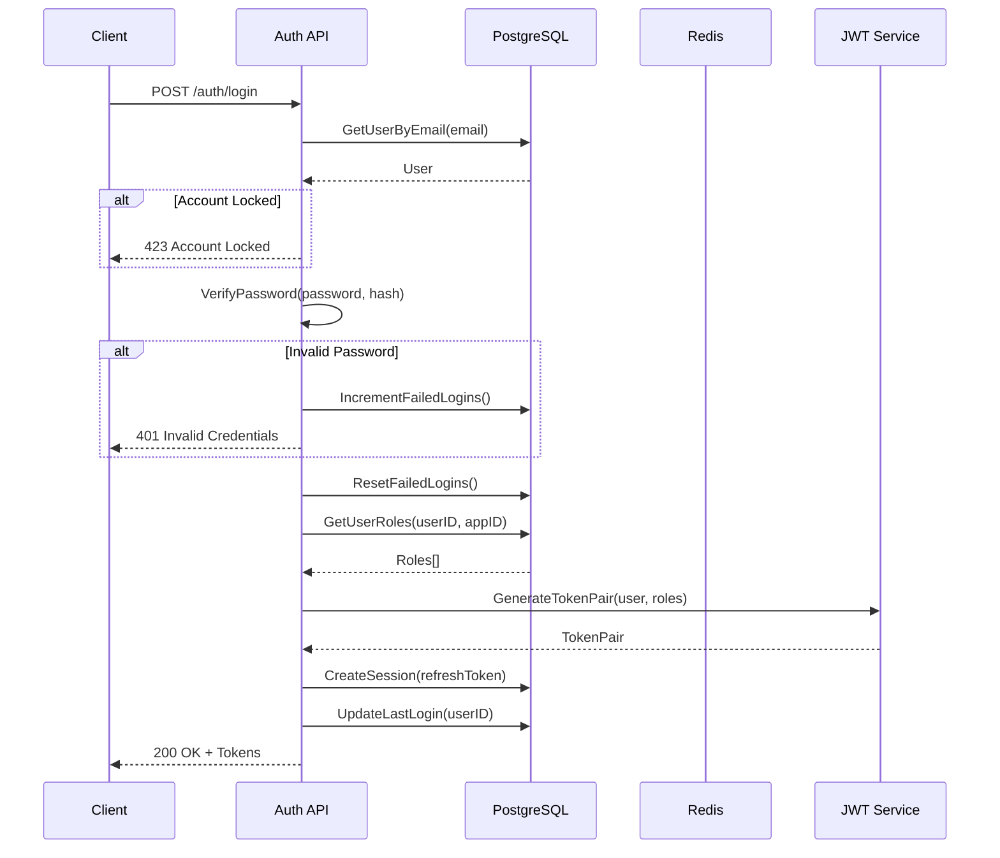
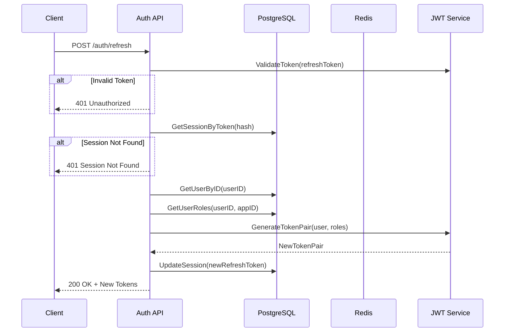
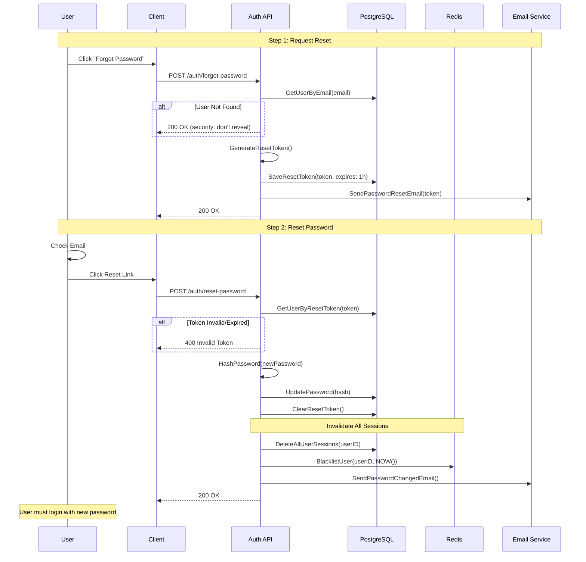
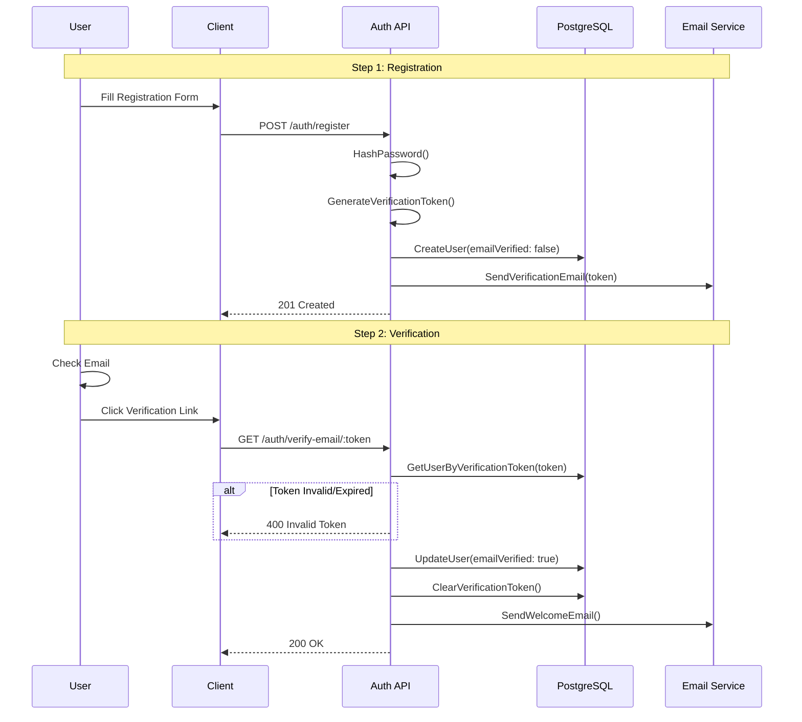
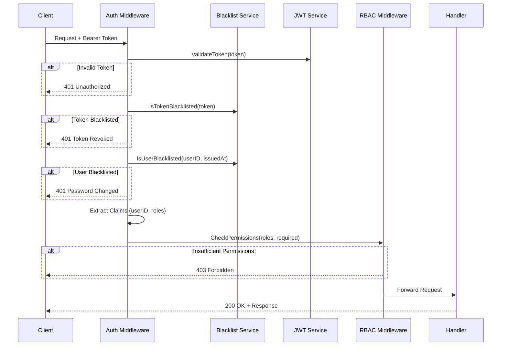
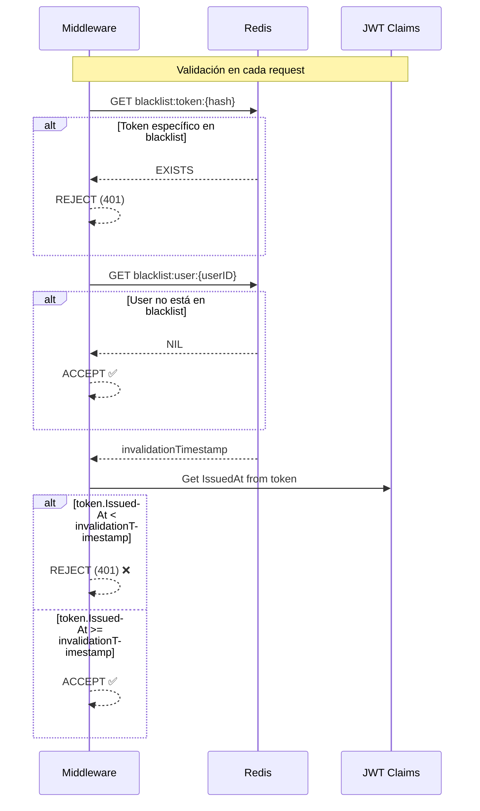
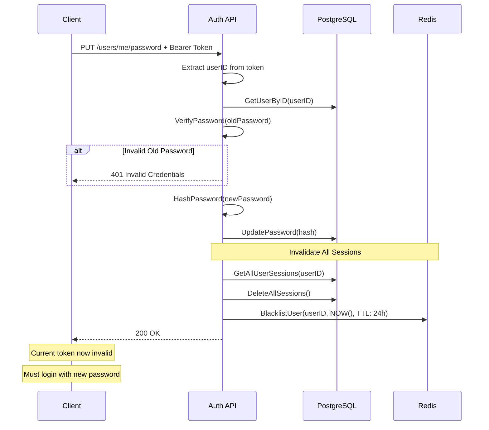

# Diagramas de Secuencia

Este documento contiene los diagramas de secuencia de los flujos principales del Auth Service.

## 📋 Índice

1. [Login Flow](#login-flow)
2. [Token Refresh Flow](#token-refresh-flow)
3. [Password Reset Flow](#password-reset-flow)
4. [Email Verification Flow](#email-verification-flow)
5. [RBAC Authorization Flow](#rbac-authorization-flow)

---

## Login Flow

---

## Token Refresh Flow

---

## Password Reset Flow

---

## Email Verification Flow

---

## RBAC Authorization Flow

---

## Token Blacklist Validation

---

## Change Password Flow (Authenticated User)

---

## Notas de Implementación

### Token Blacklist por Timestamp

El sistema usa un enfoque inteligente para invalidar tokens:

1. **Al cambiar/resetear contraseña:**
   - Se guarda `timestamp_actual` en Redis
   - TTL de 24h (más largo que lifetime máximo de tokens)

2. **Al validar token:**
   - Se compara `token.IssuedAt` con `invalidation_timestamp`
   - Si `token.IssuedAt < invalidation_timestamp` → RECHAZAR
   - Si `token.IssuedAt >= invalidation_timestamp` → ACEPTAR

3. **Ventajas:**
   - ✅ Tokens antiguos se invalidan
   - ✅ Tokens nuevos funcionan inmediatamente
   - ✅ No hay bloqueo permanente del usuario
   - ✅ Limpieza automática después de 24h

### Seguridad en Password Reset

1. **Token de un solo uso:** Se elimina después de usarse
2. **Expiración corta:** 1 hora
3. **No revelar existencia:** Siempre retorna 200 OK
4. **Invalidación total:** Cierra todas las sesiones
5. **Confirmación por email:** Notifica al usuario

---

## Herramientas para Visualización

Estos diagramas están en formato Mermaid y pueden visualizarse en:

- GitHub (renderiza automáticamente)
- VS Code (con extensión Mermaid)
- [Mermaid Live Editor](https://mermaid.live/)
- Notion, Confluence, GitLab, etc.

---

**Última actualización:** 2024-11-30  
**Versión:** 1.1.0
